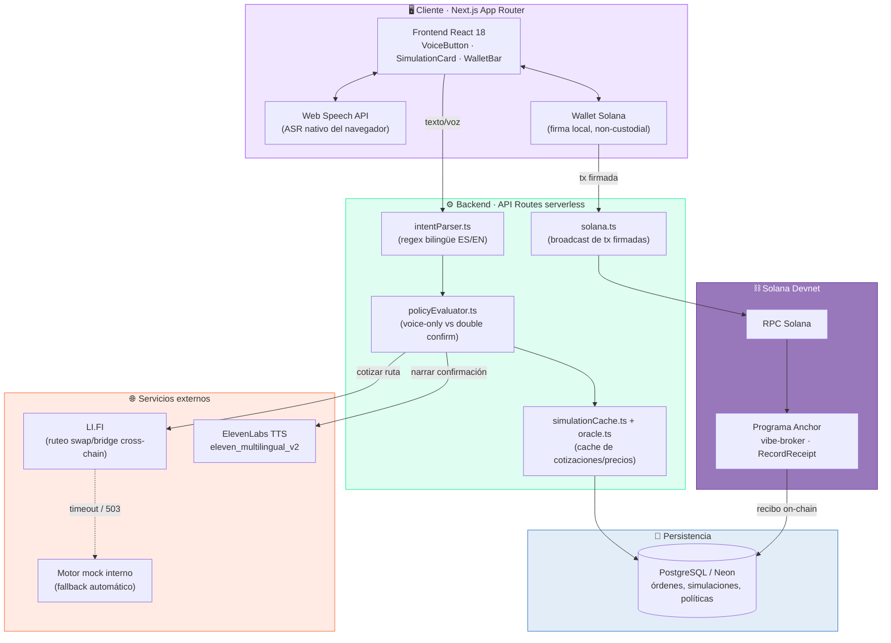
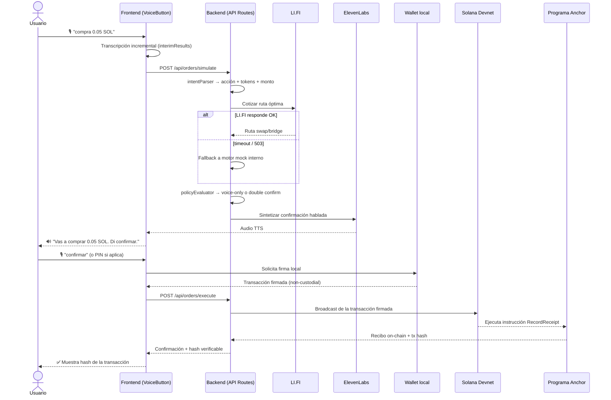
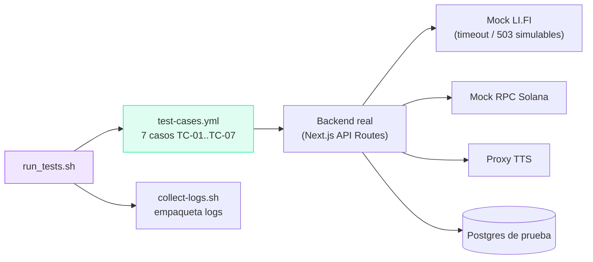
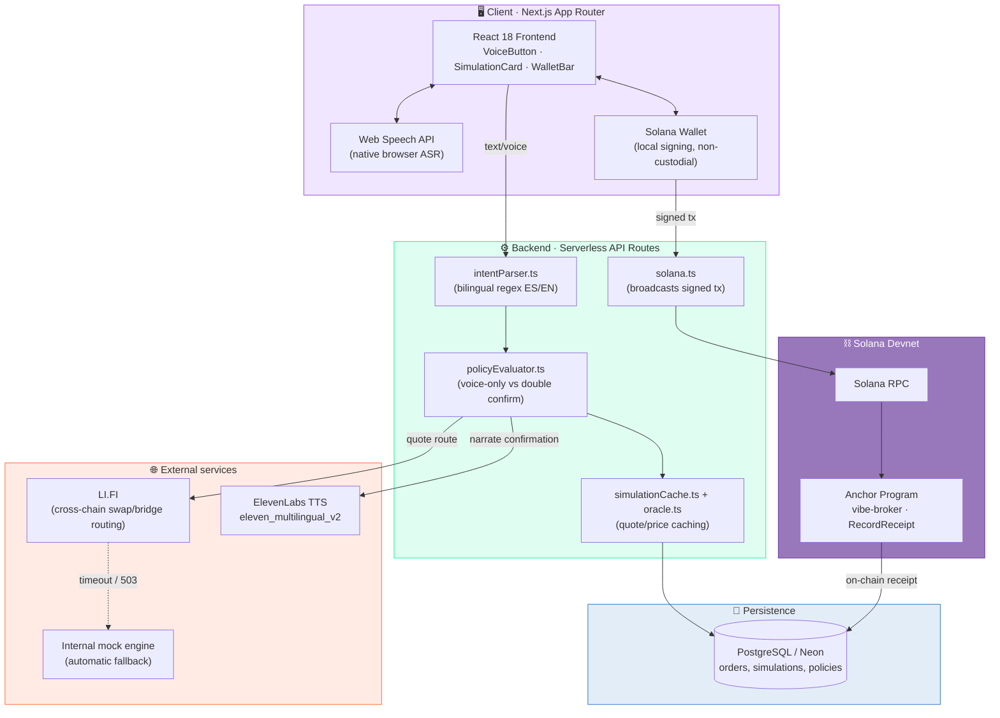
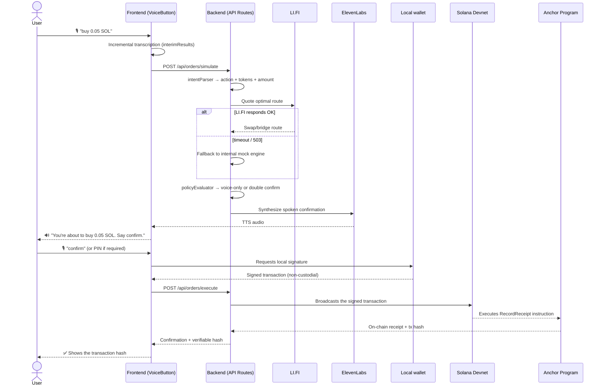
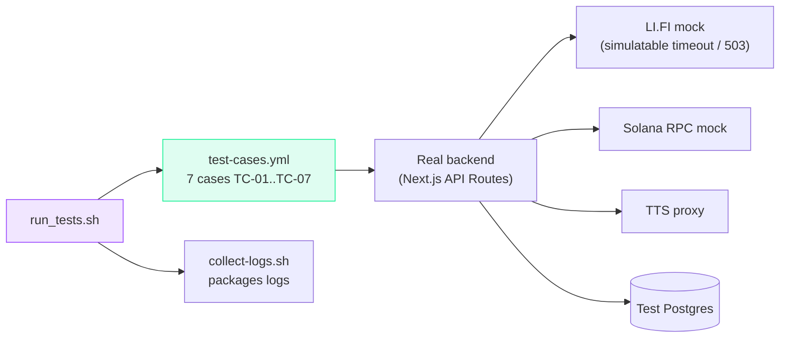

  

  

  
  
  
  
  
  
  

  

  <a href="#español"><b>🇪🇸 Español</b></a> &nbsp;·&nbsp; <a href="#english"><b>🇬🇧 English</b></a>

---

## 🇪🇸 Español

### 📑 Tabla de contenidos

- [¿Qué es Vibe Broker?](#qué-es-vibe-broker)
- [Arquitectura](#arquitectura)
- [Flujo end-to-end de una orden](#flujo-end-to-end-de-una-orden)
- [Características principales](#características-principales)
- [Stack tecnológico](#stack-tecnológico)
- [Estructura del proyecto](#estructura-del-proyecto)
- [Motor de políticas de confirmación](#motor-de-políticas-de-confirmación)
- [Suite de pruebas "Gabezo"](#suite-de-pruebas-gabezo)
- [Estado del proyecto y roadmap](#estado-del-proyecto-y-roadmap)
- [Licencia](#licencia)
- [Autor](#autor)

---

### ¿Qué es Vibe Broker?

**Vibe Broker** es un asistente conversacional —por voz y por texto— que le permite a alguien sin experiencia previa en DeFi operar sobre la blockchain de Solana usando lenguaje natural, en español o en inglés. La idea de fondo es simple: en vez de que el usuario tenga que entender slippage, rutas de swap, gas en múltiples chains o firmar transacciones a ciegas, simplemente dice o escribe algo como *"compra 0.05 SOL"* o *"cambia 10 USDC por SOL"*, y el sistema hace el resto:

1. **Escucha o lee** la orden (Web Speech API en el navegador, o texto plano).
2. **Entiende la intención** — acción, tokens de origen/destino, monto — con un parser propio bilingüe.
3. **Cotiza la mejor ruta cross-chain** consultando el agregador **LI.FI**.
4. **Narra en voz** lo que va a pasar, usando **ElevenLabs TTS**, y le pide confirmación al usuario.
5. **Aplica una política de riesgo**: montos chicos con alta confianza de reconocimiento de voz se confirman solo hablando; todo lo demás exige una segunda confirmación (PIN/passkey).
6. **Firma localmente** (el backend nunca custodia claves) y **transmite la transacción** a Solana Devnet.
7. **Deja un recibo verificable on-chain** a través de un programa **Anchor** propio, y guarda el historial completo en PostgreSQL.

Este repositorio contiene el **MVP web** del proyecto (panel de administración + demo interactiva), construido originalmente para el hackathon **Dev3pack Global** — cluster *"AI-Powered Solana DeFi Assistants"*, validado con **Colosseum Copilot** entre 270 proyectos y 11 ganadores. La interfaz está diseñada *mobile-first* (ancho máximo de 480px, como si fuera una app de teléfono corriendo en el navegador): no busca reemplazar la futura app móvil nativa, sino demostrar el flujo completo end-to-end de forma tangible.

Frente a proyectos similares presentados en el mismo hackathon (HeySolana, Lexana AI), los diferenciadores de Vibe Broker son: ruteo cross-chain **real** vía LI.FI (no simulado salvo fallback explícito), voz de salida **real** con ElevenLabs, un recibo **verificable on-chain** vía Anchor, y una política de *voice-only* configurable por variables de entorno en lugar de una confirmación binaria fija.

> **⚠️ Nota legal:** este es un prototipo educativo de hackathon. Todas las operaciones corren sobre Solana **Devnet** (no mainnet). Nada de esto constituye asesoría financiera.

### Arquitectura

Vibe Broker es una aplicación **full-stack en Next.js** (App Router) que actúa como orquestador entre servicios externos de voz, cotización cross-chain y la blockchain de Solana. El frontend nunca custodia fondos ni llama directamente a las APIs externas: todo pasa por el backend, que decide, cotiza, narra y solo entonces le devuelve al cliente una transacción para firmar localmente.

> El backend está deliberadamente diseñado para **degradar con gracia**: si LI.FI no responde (timeout, 503), cae automáticamente a un motor mock; si no hay clave de ElevenLabs configurada, el flujo continúa en modo silencioso sin romperse. Nada del pipeline principal depende de forma dura de un tercero.

### Flujo end-to-end de una orden

Así se ve, paso a paso, el recorrido completo de una orden de voz desde que el usuario abre la boca hasta que queda un recibo verificable en la blockchain:

### Características principales

**🧠 Parseo de intención**
- Motor propio basado en expresiones regulares (**sin modelos de ML externos ni LLM obligatorio**) que reconoce verbos y estructuras tanto en español como en inglés (`backend/services/intentParser.ts`).
- Manejo de conectores naturales del habla ("de", comas, órdenes con distinto orden de palabras) para tolerar cómo la gente realmente habla, no solo comandos rígidos.
- Punto de extensión opcional (`LLM_API_KEY`) para delegar el parseo a un LLM en casos ambiguos, sin que sea un requisito para el flujo base.

**💱 Cotización cross-chain**
- `backend/services/lifi.ts` consulta el agregador **LI.FI** para encontrar la ruta óptima de swap/bridge entre tokens y, potencialmente, entre chains.
- **Fallback automático a un motor mock propio** ante timeout o error 503 de LI.FI — el usuario nunca ve un flujo roto, solo una ruta con `provider: "LI.FI-mock"`.
- Caché de simulaciones y precios (`simulationCache.ts`, `oracle.ts`) para no recomputar cotizaciones innecesariamente y exponer precios vía `app/api/prices`.

**🔊 Voz: entrada y salida**
- **Entrada:** Web Speech API nativa del navegador, con transcripción incremental (`interimResults`) mientras el usuario habla — sin depender de un servicio externo de reconocimiento.
- **Salida:** `backend/services/elevenlabs.ts` sintetiza la confirmación hablada con el modelo `eleven_multilingual_v2`. Sin clave configurada, el sistema degrada a modo silencioso sin romper el flujo.
- Reactivación automática del micrófono tras narrar la confirmación, para que decir "confirmar" se sienta como una conversación real, no como un formulario.

**🛡️ Motor de políticas de confirmación**
- `backend/services/policyEvaluator.ts` decide, en base al **monto** y a la **confianza del reconocimiento de voz (ASR)**, si una orden puede confirmarse solo hablando o si exige una segunda confirmación (PIN/passkey).
- Umbrales configurables por variables de entorno (`VOICE_CONFIDENCE_MIN`, `VOICE_ONLY_MAX_PER_OP`, `VOICE_ONLY_DAILY_CAP`) — la política no está hardcodeada.

**⛓️ On-chain y firma**
- **Firma no-custodial:** el cliente firma localmente; el backend solo propaga la transacción ya firmada (`SESSION_KEYS_ALLOWED=false` por defecto).
- **Recibo verificable on-chain:** programa **Anchor** (`onchain/programs/vibe-broker`, Rust) con instrucción `RecordReceipt`, desplegado en Solana Devnet.
- Contrato **Solidity de referencia** (`onchain/solidity/VibeBrokerReceipt.sol`) para escenarios EVM, pensado como puente conceptual hacia otras chains.

**📊 Panel, historial y persistencia**
- Historial de órdenes, simulaciones y políticas por usuario en **PostgreSQL**, con soporte para **Neon** (Postgres serverless) en producción.
- Dashboard animado: componentes React con **GSAP + ScrollTrigger**, un `ParticleCanvas` propio, fondo animado (`AnimatedBackground`), widget de portafolio (`PortfolioWidget`), barra de uso diario (`DailyUsageBar`) y modo claro/oscuro (`ThemeProvider` / `ThemeToggle`).
- Integración de wallet Solana desde el frontend (`WalletBar`, `useWallet`).

**🧪 Testing**
- **16 tests unitarios con Jest** cubriendo el parser de intenciones y el evaluador de políticas.
- Suite de integración end-to-end propia, apodada **"Gabezo"** (ver sección dedicada más abajo), con mocks de LI.FI, RPC de Solana y proxy de TTS para probar el sistema completo sin gastar cuota de APIs reales.

### Stack tecnológico

| Categoría | Tecnología |
|---|---|
| Framework full-stack | [Next.js 14.2](https://nextjs.org/) (App Router) |
| Lenguaje | TypeScript 5.4 |
| UI / Estilos | React 18.3, Tailwind CSS 3.4, CSS custom (design system dark/light) |
| Animación | GSAP 3.15 (`@gsap/react`), ScrollTrigger, Canvas para partículas |
| Blockchain (cliente) | `@solana/web3.js` 1.91 |
| Blockchain (on-chain) | Anchor / Rust (programa Solana), Solidity de referencia (EVM) |
| Orquestación cross-chain | SDK de LI.FI (con fallback mock propio) |
| Voz → texto | Web Speech API (nativa del navegador) |
| Texto → voz | ElevenLabs TTS (`eleven_multilingual_v2`) |
| Base de datos | PostgreSQL (driver `pg`), Neon en producción |
| Testing | Jest 29 + ts-jest, entorno Docker "Gabezo" para pruebas de integración |
| Infraestructura / Deploy | Vercel, Docker / Docker Compose para el entorno de pruebas |
| Utilidades | `uuid` para IDs de simulación/orden |

### Estructura del proyecto

```mermaid
graph TD
    Root["/"]
    Root --> App["app/ — Next.js App Router"]
    App --> AppPublic["(public)/ — Landing + Login"]
    App --> AppDash["(dashboard)/ — App autenticada"]
    App --> AppApi["api/ — Rutas serverless"]
    AppApi --> ApiHealth["health/"]
    AppApi --> ApiOrders["orders/ — simulate · execute"]
    AppApi --> ApiPrices["prices/ — oráculo de precios"]
    AppApi --> ApiUsers["users/[id]/settings/"]
    AppApi --> ApiVoice["voice/tts/"]

    Root --> Backend["backend/"]
    Backend --> Services["services/ — intentParser · lifi · elevenlabs<br/>solana · oracle · policyEvaluator · simulationCache"]
    Backend --> Db["db/ — pool PostgreSQL + migrations"]
    Backend --> Policies["config/policies.json"]

    Root --> Frontend["frontend/"]
    Frontend --> Components["components/ — VoiceButton · SimulationCard<br/>ConfirmationModal · WalletBar · PortfolioWidget"]
    Frontend --> Hooks["hooks/ — useSimulate · useExecute · useSpeech<br/>useWallet · useOrderHistory · usePortfolio"]
    Frontend --> Styles["styles/ — globals.css (dark/light)"]

    Root --> Onchain["onchain/"]
    Onchain --> Program["programs/vibe-broker/ — Anchor (Rust)<br/>instrucción RecordReceipt"]
    Onchain --> Solidity["solidity/ — contrato de referencia EVM"]
    Onchain --> OnchainTests["tests/ — tests del programa"]

    Root --> Gabezo["gabezo/ — entorno de pruebas E2E"]
    Gabezo --> Mocks["mocks/ — LI.FI · RPC Solana · proxy TTS"]
    Gabezo --> TestCases["test-cases.yml — 7 casos TC-01..TC-07"]

    Root --> Tests["__tests__/ — Jest unitarios"]
    Root --> Scripts["scripts/ — migrate.js · test-apis.js"]
    Root --> Types["types/ — tipos compartidos"]
    Root --> Public["public/ — assets estáticos"]

    style Root fill:#9945FF33,stroke:#9945FF
    style App fill:#14F19522,stroke:#14F195
    style Backend fill:#FF6B3522,stroke:#FF6B35
    style Onchain fill:#663399aa,stroke:#663399,color:#fff
    style Gabezo fill:#3178C622,stroke:#3178C6
```

### Motor de políticas de confirmación

El corazón de la seguridad conversacional de Vibe Broker es una tabla de decisión simple pero configurable:

| Condición | Flujo resultante |
|---|---|
| Monto ≤ 0.1 SOL **y** confianza ASR ≥ 0.8 | **Voice-only** — confirmación solo por voz ("confirmar") |
| Monto > 0.1 SOL **o** confianza ASR < 0.8 | **Double** — voz + PIN/passkey como segundo factor |

Los umbrales (`VOICE_CONFIDENCE_MIN`, `VOICE_ONLY_MAX_PER_OP`, `VOICE_ONLY_DAILY_CAP`) viven fuera del código, lo que permite endurecer o relajar la política sin tocar `policyEvaluator.ts`. Además de la evaluación por operación, existe un **tope diario acumulado** de monto en modo voice-only, para que una sucesión de órdenes pequeñas no termine drenando fondos sin una confirmación fuerte.

**Endpoints principales de la API:**

| Método | Ruta | Descripción |
|---|---|---|
| `GET`  | `/api/health` | Healthcheck |
| `GET`  | `/api/prices` | Precios de tokens |
| `POST` | `/api/orders/simulate` | Parsea intención → cotización LI.FI → evalúa política |
| `POST` | `/api/orders/execute` | Propaga transacción firmada → guarda en DB → genera recibo |
| `GET`  | `/api/orders` | Historial de órdenes del usuario |
| `POST` | `/api/voice/tts` | Síntesis de voz (ElevenLabs) |
| `GET`  | `/api/users/:id/settings` | Consulta la política de voz del usuario |
| `POST` | `/api/users/:id/settings` | Actualiza la política de voz del usuario |

### Suite de pruebas "Gabezo"

**Gabezo** es el entorno de integración end-to-end del proyecto: un stack de Docker Compose independiente que levanta el backend junto con mocks de LI.FI, del RPC de Solana y un proxy de TTS, para poder ejercitar el sistema completo — incluyendo fallas y condiciones de carrera — sin gastar cuota de APIs reales ni depender de que estén disponibles.

| Caso | Escenario |
|---|---|
| TC-01 | Happy Path completo (simulate + execute, voice-only) |
| TC-02 | LI.FI timeout → fallback a mock automático |
| TC-03 | ASR con confianza baja → exige doble confirmación |
| TC-04 | Firma vacía → 400 `MISSING_FIELDS` |
| TC-05 | Estrés: 10 solicitudes concurrentes a `/simulate` (< 5s, 100% éxito) |
| TC-06 | LI.FI responde 503 → fallback a mock |
| TC-07 | Intención desconocida → 422 `UNKNOWN_INTENT` |

A esto se suman los **16 tests unitarios con Jest** que cubren el parser de intenciones y el evaluador de políticas de forma aislada, sin depender de Docker ni de servicios externos.

### Estado del proyecto y roadmap

Este repositorio es el **MVP de la interfaz web** (nivel de madurez: **prototipo de hackathon**, no producción), concebido como la primera pieza de una visión de tres interfaces:

- [x] **Web admin (este repositorio)** — MVP funcional en Next.js 14 + Tailwind + GSAP, con flujo completo de voz, cotización, confirmación y recibo on-chain.
- [x] Parseo de intención bilingüe (ES/EN) sin dependencia de LLM.
- [x] Fallback automático LI.FI → mock ante fallas.
- [x] Motor de políticas de confirmación configurable (voice-only / double).
- [x] Programa Anchor desplegado en Devnet con recibo verificable.
- [x] Suite de integración "Gabezo" (7 casos) + 16 tests unitarios Jest.
- [ ] **App móvil (v2)** — React Native + Solana Mobile SDK, pensada para ejecutar operaciones "reales" del producto final.
- [ ] **Robot / dispositivo tipo Alexa (v3)** — ElevenLabs bidireccional corriendo sobre un Raspberry Pi, como interfaz física dedicada.
- [ ] Migración de mainnet (actualmente todo corre exclusivamente sobre **Solana Devnet**).

Desarrollado originalmente para el hackathon **Dev3pack Global** (pistas Solana, LI.FI, ElevenLabs, Virtuals, Solana Mobile), en el cluster *"AI-Powered Solana DeFi Assistants"* — validado con **Colosseum Copilot** entre 270 proyectos y 11 ganadores.

### Licencia

Este repositorio **no incluye un archivo `LICENSE`**. Por lo tanto, **todos los derechos reservados** — proyecto de [jackson1939](https://github.com/jackson1939) y colaboradores. No se otorga licencia de uso, copia, modificación o distribución salvo autorización explícita del autor.

### Autor

  

**Contribuyentes:**

- [Dax Kenji Tellez Duran](https://github.com/Kenyi001)
- [jackson1939](https://github.com/jackson1939)
- [Vctor11180](https://github.com/Vctor11180)
- [Ronald Augusto R](https://github.com/ronaldaugust2002)

---

## 🇬🇧 English

### 📑 Table of contents

- [What is Vibe Broker?](#what-is-vibe-broker)
- [Architecture](#architecture)
- [End-to-end order flow](#end-to-end-order-flow)
- [Key features](#key-features)
- [Tech stack](#tech-stack)
- [Project structure](#project-structure)
- [Confirmation policy engine](#confirmation-policy-engine)
- [The "Gabezo" test suite](#the-gabezo-test-suite)
- [Project status and roadmap](#project-status-and-roadmap)
- [License](#license)
- [Author](#author)

---

### What is Vibe Broker?

**Vibe Broker** is a conversational assistant — voice and text — that lets someone with zero prior DeFi experience operate on the Solana blockchain using natural language, in Spanish or English. The core idea is simple: instead of making the user understand slippage, swap routes, multi-chain gas, or sign transactions blindly, they just say or type something like *"buy 0.05 SOL"* or *"swap 10 USDC for SOL"*, and the system does the rest:

1. **Listens or reads** the order (browser Web Speech API, or plain text).
2. **Understands the intent** — action, source/destination tokens, amount — via a custom bilingual parser.
3. **Quotes the best cross-chain route** by querying the **LI.FI** aggregator.
4. **Narrates out loud** what is about to happen, using **ElevenLabs TTS**, and asks the user to confirm.
5. **Applies a risk policy**: small amounts with high speech-recognition confidence can be confirmed by voice alone; everything else requires a second confirmation factor (PIN/passkey).
6. **Signs locally** (the backend never holds custody of keys) and **broadcasts the transaction** to Solana Devnet.
7. **Leaves a verifiable on-chain receipt** through a custom **Anchor** program, and stores the full history in PostgreSQL.

This repository holds the project's **web MVP** (admin panel + interactive demo), originally built for the **Dev3pack Global** hackathon — *"AI-Powered Solana DeFi Assistants"* cluster, validated by **Colosseum Copilot** among 270 projects and 11 winners. The UI is designed **mobile-first** (max width 480px, as if it were a phone app running in the browser): it doesn't aim to replace the future native mobile app, but to tangibly demonstrate the full end-to-end flow.

Compared to similar projects presented at the same hackathon (HeySolana, Lexana AI), Vibe Broker's differentiators are: **real** cross-chain routing via LI.FI (not simulated except for explicit fallback), **real** voice output via ElevenLabs, a **verifiable on-chain receipt** via Anchor, and a configurable *voice-only* policy driven by environment variables rather than a fixed binary confirmation.

> **⚠️ Legal notice:** this is an educational hackathon prototype. All operations run on Solana **Devnet** (not mainnet). None of this constitutes financial advice.

### Architecture

Vibe Broker is a **full-stack Next.js application** (App Router) that acts as the orchestrator between external voice services, cross-chain quoting, and the Solana blockchain. The frontend never holds custody of funds nor calls external APIs directly: everything flows through the backend, which decides, quotes, narrates, and only then hands the client a transaction to sign locally.

> The backend is deliberately designed to **degrade gracefully**: if LI.FI doesn't respond (timeout, 503), it automatically falls back to a mock engine; if no ElevenLabs key is configured, the flow continues in silent mode without breaking. Nothing in the main pipeline hard-depends on a third party.

### End-to-end order flow

Here's the full, step-by-step journey of a voice order, from the moment the user speaks to a verifiable receipt landing on-chain:

### Key features

**🧠 Intent parsing**
- Custom regex-based engine (**no external ML models or mandatory LLM**) that recognizes verbs and phrasing in both Spanish and English (`backend/services/intentParser.ts`).
- Handles natural speech connectors ("de", commas, orders with different word ordering) to tolerate how people actually talk, not just rigid commands.
- Optional extension point (`LLM_API_KEY`) to delegate parsing to an LLM for ambiguous cases, without it being required for the base flow.

**💱 Cross-chain quoting**
- `backend/services/lifi.ts` queries the **LI.FI** aggregator to find the optimal swap/bridge route between tokens and, potentially, across chains.
- **Automatic fallback to a custom mock engine** on LI.FI timeout or 503 — the user never sees a broken flow, just a route tagged `provider: "LI.FI-mock"`.
- Simulation and price caching (`simulationCache.ts`, `oracle.ts`) to avoid recomputing quotes unnecessarily, and prices exposed via `app/api/prices`.

**🔊 Voice: input and output**
- **Input:** native browser Web Speech API, with incremental transcription (`interimResults`) while the user speaks — no dependency on an external recognition service.
- **Output:** `backend/services/elevenlabs.ts` synthesizes the spoken confirmation using the `eleven_multilingual_v2` model. Without a configured key, the system gracefully degrades to silent mode without breaking the flow.
- Automatic microphone reactivation after narrating the confirmation, so saying "confirm" feels like a real conversation, not a form submission.

**🛡️ Confirmation policy engine**
- `backend/services/policyEvaluator.ts` decides, based on **amount** and **speech-recognition confidence (ASR)**, whether an order can be confirmed by voice alone or requires a second confirmation factor (PIN/passkey).
- Thresholds configurable via environment variables (`VOICE_CONFIDENCE_MIN`, `VOICE_ONLY_MAX_PER_OP`, `VOICE_ONLY_DAILY_CAP`) — the policy isn't hardcoded.

**⛓️ On-chain and signing**
- **Non-custodial signing:** the client signs locally; the backend only broadcasts the already-signed transaction (`SESSION_KEYS_ALLOWED=false` by default).
- **Verifiable on-chain receipt:** an **Anchor** program (`onchain/programs/vibe-broker`, Rust) with a `RecordReceipt` instruction, deployed on Solana Devnet.
- **Reference Solidity contract** (`onchain/solidity/VibeBrokerReceipt.sol`) for EVM scenarios, conceived as a conceptual bridge toward other chains.

**📊 Dashboard, history and persistence**
- Order, simulation and policy history per user in **PostgreSQL**, with support for **Neon** (serverless Postgres) in production.
- Animated dashboard: React components using **GSAP + ScrollTrigger**, a custom `ParticleCanvas`, an animated background (`AnimatedBackground`), a portfolio widget (`PortfolioWidget`), a daily-usage bar (`DailyUsageBar`), and light/dark mode (`ThemeProvider` / `ThemeToggle`).
- Solana wallet integration from the frontend (`WalletBar`, `useWallet`).

**🧪 Testing**
- **16 Jest unit tests** covering the intent parser and the policy evaluator.
- A custom end-to-end integration suite, nicknamed **"Gabezo"** (see dedicated section below), with mocks for LI.FI, the Solana RPC, and a TTS proxy to exercise the full system without spending real API quota.

### Tech stack

| Category | Technology |
|---|---|
| Full-stack framework | [Next.js 14.2](https://nextjs.org/) (App Router) |
| Language | TypeScript 5.4 |
| UI / Styling | React 18.3, Tailwind CSS 3.4, custom CSS (dark/light design system) |
| Animation | GSAP 3.15 (`@gsap/react`), ScrollTrigger, canvas-based particle system |
| Blockchain (client) | `@solana/web3.js` 1.91 |
| Blockchain (on-chain) | Anchor / Rust (Solana program), reference Solidity contract (EVM) |
| Cross-chain orchestration | LI.FI SDK (with a custom mock fallback) |
| Speech-to-text | Web Speech API (native browser) |
| Text-to-speech | ElevenLabs TTS (`eleven_multilingual_v2`) |
| Database | PostgreSQL (`pg` driver), Neon in production |
| Testing | Jest 29 + ts-jest, "Gabezo" Docker environment for integration testing |
| Infrastructure / Deploy | Vercel, Docker / Docker Compose for the test environment |
| Utilities | `uuid` for simulation/order IDs |

### Project structure

### Confirmation policy engine

The heart of Vibe Broker's conversational security is a simple but configurable decision table:

| Condition | Resulting flow |
|---|---|
| Amount ≤ 0.1 SOL **and** ASR confidence ≥ 0.8 | **Voice-only** — confirmation by voice alone ("confirm") |
| Amount > 0.1 SOL **or** ASR confidence < 0.8 | **Double** — voice + PIN/passkey as second factor |

Thresholds (`VOICE_CONFIDENCE_MIN`, `VOICE_ONLY_MAX_PER_OP`, `VOICE_ONLY_DAILY_CAP`) live outside the codebase, letting the policy be tightened or relaxed without touching `policyEvaluator.ts`. Beyond per-operation evaluation, there's a **cumulative daily cap** on voice-only amounts, so a string of small orders can't drain funds without ever hitting a strong confirmation.

**Main API endpoints:**

| Method | Route | Description |
|---|---|---|
| `GET`  | `/api/health` | Healthcheck |
| `GET`  | `/api/prices` | Token prices |
| `POST` | `/api/orders/simulate` | Parses intent → LI.FI quote → policy evaluation |
| `POST` | `/api/orders/execute` | Broadcasts the signed transaction → stores in DB → generates receipt |
| `GET`  | `/api/orders` | User's order history |
| `POST` | `/api/voice/tts` | Voice synthesis (ElevenLabs) |
| `GET`  | `/api/users/:id/settings` | Retrieves the user's voice policy |
| `POST` | `/api/users/:id/settings` | Updates the user's voice policy |

### The "Gabezo" test suite

**Gabezo** is the project's end-to-end integration environment: a standalone Docker Compose stack that spins up the backend alongside mocks for LI.FI, the Solana RPC, and a TTS proxy, so the full system — including failures and race conditions — can be exercised without spending real API quota or depending on third-party availability.

| Case | Scenario |
|---|---|
| TC-01 | Full happy path (simulate + execute, voice-only) |
| TC-02 | LI.FI timeout → automatic mock fallback |
| TC-03 | Low ASR confidence → forces double confirmation |
| TC-04 | Empty signature → 400 `MISSING_FIELDS` |
| TC-05 | Stress: 10 concurrent requests to `/simulate` (< 5s, 100% success) |
| TC-06 | LI.FI returns 503 → mock fallback |
| TC-07 | Unknown intent → 422 `UNKNOWN_INTENT` |

Alongside this, **16 Jest unit tests** cover the intent parser and the policy evaluator in isolation, with no dependency on Docker or external services.

### Project status and roadmap

This repository is the **web interface MVP** (maturity level: **hackathon prototype**, not production-grade), conceived as the first piece of a three-interface vision:

- [x] **Web admin (this repository)** — functional MVP in Next.js 14 + Tailwind + GSAP, with a complete voice, quoting, confirmation and on-chain receipt flow.
- [x] Bilingual intent parsing (ES/EN) with no LLM dependency.
- [x] Automatic LI.FI → mock fallback on failure.
- [x] Configurable confirmation policy engine (voice-only / double).
- [x] Anchor program deployed on Devnet with a verifiable receipt.
- [x] "Gabezo" integration suite (7 cases) + 16 Jest unit tests.
- [ ] **Mobile app (v2)** — React Native + Solana Mobile SDK, meant to execute the final product's "real" operations.
- [ ] **Robot / Alexa-like device (v3)** — bidirectional ElevenLabs running on a Raspberry Pi, as a dedicated physical interface.
- [ ] Mainnet migration (everything currently runs exclusively on **Solana Devnet**).

Originally built for the **Dev3pack Global** hackathon (Solana, LI.FI, ElevenLabs, Virtuals, Solana Mobile tracks), in the *"AI-Powered Solana DeFi Assistants"* cluster — validated by **Colosseum Copilot** among 270 projects and 11 winners.

### License

This repository **does not include a `LICENSE` file**. Therefore, **all rights reserved** — a project by [jackson1939](https://github.com/jackson1939) and contributors. No license to use, copy, modify, or distribute is granted without the author's explicit authorization.

### Author

  

**Contributors:**

- [Dax Kenji Tellez Duran](https://github.com/Kenyi001)
- [jackson1939](https://github.com/jackson1939)
- [Vctor11180](https://github.com/Vctor11180)
- [Ronald Augusto R](https://github.com/ronaldaugust2002)

  

