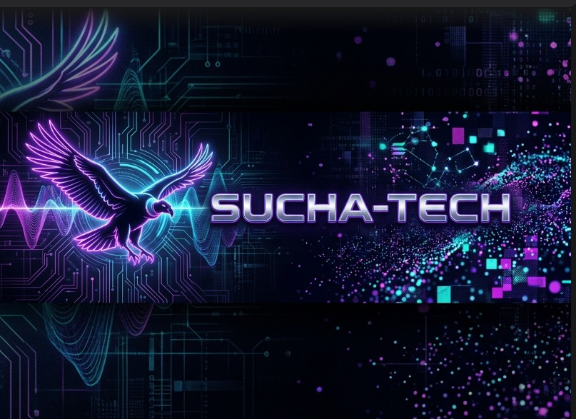

<p align="center">
  
</p>

<h1 align="center">🎙️ Vibe Broker</h1>

<p align="center">
  <b>El "Alexa" de las transacciones Web3</b> — asistente conversacional por voz y texto que orquesta swaps y bridges cross-chain en Solana con confirmaciones habladas.<br/>
  <i>The "Alexa" of Web3 transactions</i> — a voice- and text-driven conversational assistant that orchestrates cross-chain swaps and bridges on Solana with spoken confirmations.
</p>

<p align="center">
  
  
  
  
  
  
</p>

<p align="center">
  <a href="#español">Español</a> ·
  <a href="#english">English</a>
</p>

---

<a name="español"></a>

## 🇪🇸 Español

### Descripción / Overview

**Vibe Broker** es un asistente conversacional (voz y texto) que permite a usuarios sin experiencia en DeFi interactuar con la blockchain de Solana usando lenguaje natural. En vez de navegar una interfaz compleja de exchange, el usuario simplemente dice o escribe algo como *"compra 0.05 SOL"*, y el sistema:

1. Parsea la intención del usuario (acción, tokens, monto).
2. Consulta la ruta óptima de swap/bridge a través de **LI.FI**.
3. Narra la simulación de la operación en voz mediante **ElevenLabs TTS**.
4. Aplica una política de confirmación (solo voz o doble confirmación) según el monto y la confianza del reconocimiento de voz.
5. Firma la transacción localmente (non-custodial) y la propaga a **Solana Devnet**.
6. Registra un recibo on-chain mediante un programa **Anchor** y guarda el historial en **PostgreSQL**.

Este repositorio corresponde al **MVP web** del proyecto (panel de administración y demo), desarrollado originalmente para el hackathon **Dev3pack Global** (pistas Solana, LI.FI, ElevenLabs, Virtuals, Solana Mobile). La web funciona como una demo *mobile-first* (ancho máximo 480px) — no está pensada para reemplazar la futura app móvil, sino para mostrar el flujo completo end-to-end.

> **Nota legal:** Prototipo educativo de hackathon. Todas las operaciones se realizan en Solana **Devnet**. Esto **no es asesoría financiera**.

### Características principales

- **Entrada por voz en tiempo real** — Web Speech API (ASR nativo del navegador) con transcripción incremental (`interimResults`) mientras el usuario habla, sin depender de servicios externos de reconocimiento.
- **Parseo de intención bilingüe** — motor basado en expresiones regulares (sin modelos de ML externos) que reconoce verbos y estructuras en español e inglés (`backend/services/intentParser.ts`), incluyendo manejo de conectores como "de" y comas.
- **Cotización cross-chain vía LI.FI** — el servicio `backend/services/lifi.ts` consulta la ruta óptima de swap/bridge y cuenta con **fallback automático a un motor mock** si la API no responde o falla (timeout, 503, etc.).
- **Voz de salida natural** — `backend/services/elevenlabs.ts` sintetiza la confirmación hablada usando el modelo `eleven_multilingual_v2` de ElevenLabs; sin clave configurada, el sistema degrada a modo silencioso sin romper el flujo.
- **Motor de políticas de confirmación** — `backend/services/policyEvaluator.ts` decide si una operación puede confirmarse **solo con voz** (monto pequeño + alta confianza ASR) o requiere **doble confirmación** (voz + PIN/passkey), con límites configurables por variables de entorno (`VOICE_CONFIDENCE_MIN`, `VOICE_ONLY_MAX_PER_OP`, `VOICE_ONLY_DAILY_CAP`).
- **Firma no-custodial** — el cliente firma localmente; el backend solo propaga la transacción ya firmada (`SESSION_KEYS_ALLOWED=false` por defecto).
- **Recibo on-chain verificable** — programa Anchor (`onchain/programs/vibe-broker`, Rust) con instrucción `RecordReceipt` desplegado en Solana Devnet, más un contrato Solidity de referencia (`onchain/solidity/VibeBrokerReceipt.sol`) para escenarios EVM.
- **Historial y persistencia** — órdenes, simulaciones y políticas de usuario se guardan en PostgreSQL (`backend/db/`), con soporte para Neon en producción (serverless Postgres).
- **Caché de simulaciones y precios** — `backend/services/simulationCache.ts` y `backend/services/oracle.ts` evitan recomputar cotizaciones y exponen precios vía `app/api/prices`.
- **Panel/dashboard con animaciones** — componentes React con GSAP + ScrollTrigger + un `ParticleCanvas` propio, fondo animado (`AnimatedBackground`), widget de portafolio (`PortfolioWidget`), barra de uso diario (`DailyUsageBar`) y modo claro/oscuro (`ThemeProvider` / `ThemeToggle`).
- **Integración de wallet** — `WalletBar` y `useWallet` para conexión de wallet de Solana desde el frontend.
- **Suite de pruebas end-to-end simulada ("Gabezo")** — entorno Docker Compose independiente con mocks de LI.FI, RPC de Solana y proxy de TTS, orientado a probar 7 escenarios (happy path, timeouts, fallos, concurrencia, confianza baja, etc.) sin gastar cuota de APIs reales.
- **Tests unitarios con Jest** — cobertura del parser de intenciones y del evaluador de políticas (16 tests).

### Stack tecnológico

| Categoría | Tecnología |
|---|---|
| Framework full-stack | [Next.js 14.2](https://nextjs.org/) (App Router) |
| Lenguaje | TypeScript 5.4 |
| UI / Estilos | React 18.3, Tailwind CSS 3.4, CSS custom (design system dark/light) |
| Animación | GSAP 3.15 (`@gsap/react`), ScrollTrigger, Canvas para partículas |
| Blockchain (cliente) | `@solana/web3.js` 1.91 |
| Blockchain (on-chain) | Anchor / Rust (programa Solana), Solidity de referencia (EVM) |
| Orquestación cross-chain | SDK de LI.FI (con fallback mock propio) |
| Voz → texto | Web Speech API (nativa del navegador) |
| Texto → voz | ElevenLabs TTS (`eleven_multilingual_v2`) |
| Base de datos | PostgreSQL (driver `pg`), Neon en producción |
| Testing | Jest 29 + ts-jest, entorno Docker "Gabezo" para pruebas de integración |
| Infraestructura / Deploy | Vercel (`vercel.json`), Docker / Docker Compose para entorno de pruebas |
| Utilidades | `uuid` para IDs de simulación/orden |

### Arquitectura / Estructura de carpetas

```
/
├── app/                          Next.js App Router
│   ├── (public)/                 Landing + Login (sin navbar)
│   ├── (dashboard)/              App autenticada con navbar (dashboard/*)
│   └── api/                      API Routes serverless
│       ├── health/               Healthcheck
│       ├── orders/                Simular, ejecutar y listar órdenes
│       ├── prices/                Precios de tokens (oráculo)
│       ├── users/[id]/settings/  Política de voz por usuario
│       └── voice/tts/             Síntesis de voz (ElevenLabs)
├── backend/
│   ├── services/                  Lógica de negocio: intentParser, lifi, elevenlabs,
│   │                              solana, oracle, policyEvaluator, simulationCache
│   ├── db/                        Pool de conexión PostgreSQL + migrations
│   └── config/policies.json       Configuración de políticas de confirmación
├── frontend/
│   ├── components/                VoiceButton, SimulationCard, ConfirmationModal,
│   │                              WalletBar, PortfolioWidget, AnimatedBackground...
│   ├── hooks/                     useSimulate, useExecute, useSpeech, useWallet,
│   │                              useOrderHistory, usePortfolio, useVoiceSettings
│   └── styles/                    globals.css (design system dark/light)
├── onchain/
│   ├── programs/vibe-broker/      Programa Anchor (Rust) — instrucción RecordReceipt
│   ├── solidity/                  Contrato de referencia para entornos EVM
│   └── tests/                     Tests del programa on-chain
├── gabezo/                        Entorno de pruebas end-to-end con mocks (Docker)
│   ├── mocks/                     Mocks de LI.FI, RPC de Solana y proxy de TTS
│   └── test-cases.yml             Definición de los 7 casos de prueba
├── __tests__/                     Tests unitarios Jest (intentParser, policyEvaluator)
├── scripts/                       migrate.js (migraciones DB), test-apis.js (verifica claves)
├── types/                         Tipos TypeScript compartidos (intents, simulate, execute...)
├── public/                        Assets estáticos (logo, banner, favicon)
├── docker-compose.gabezo.yml      Orquestación del entorno de pruebas Gabezo
├── Dockerfile.dev                 Imagen de desarrollo/test del backend
└── vercel.json                    Configuración de despliegue en Vercel
```

### Requisitos previos

- **Node.js** ≥ 18 (recomendado 20, usado en las imágenes Docker del proyecto)
- **npm** (el repo incluye `package-lock.json`)
- **PostgreSQL** accesible (local, Docker, o Neon en la nube)
- **Docker + Docker Compose** (opcional, solo para el entorno de pruebas Gabezo)
- **Anchor CLI** + toolchain de Rust/Solana (opcional, solo si vas a compilar/desplegar el programa on-chain)
- Claves de API (opcionales para desarrollo, obligatorias para producción):
  - API key de **LI.FI**
  - API key de **ElevenLabs**

### Instalación y configuración

```bash
# 1. Clonar el repositorio
git clone https://github.com/jackson1939/sucha-tech.git
cd sucha-tech

# 2. Instalar dependencias
npm install

# 3. Configurar variables de entorno
cp .env.example .env.local
# Editar .env.local y completar las claves necesarias (ver sección siguiente)

# 4. Preparar la base de datos (si usás Postgres local)
npm run db:migrate

# 5. Levantar el entorno de desarrollo
npm run dev
# → http://localhost:3000
```

### Uso / Cómo correr el proyecto

**Desarrollo local:**

```bash
npm run dev      # Servidor de desarrollo en http://localhost:3000
npm run build    # Build de producción
npm run start    # Servidor de producción (requiere build previo)
npm run lint     # Linter (eslint-config-next)
```

**Pruebas unitarias:**

```bash
npm test               # Jest: intentParser + policyEvaluator (16 tests)
npm run test:watch     # Jest en modo watch
npm run test:apis      # Verifica que las claves de LI.FI / ElevenLabs funcionen
```

**Entorno de pruebas de integración "Gabezo" (Docker, con mocks):**

```bash
./gabezo/start.sh       # Levanta backend + Postgres + mocks (LI.FI, RPC, TTS)
./gabezo/run_tests.sh   # Ejecuta los 7 casos de prueba (TC-01 a TC-07)
./gabezo/stop.sh        # Apaga los contenedores y empaqueta los logs
```

| Caso | Escenario |
|---|---|
| TC-01 | Happy Path completo (simulate + execute) |
| TC-02 | LI.FI timeout → fallback a mock automático |
| TC-03 | ASR con confianza baja → exige doble confirmación |
| TC-04 | Firma vacía → 400 |
| TC-05 | Estrés: 10 solicitudes concurrentes |
| TC-06 | LI.FI responde 503 → fallback a mock |
| TC-07 | Intención desconocida → 422 |

**Programa on-chain (Anchor):**

```bash
cd onchain
anchor build
anchor deploy --provider.cluster devnet
# Copiar el Program ID generado → RECEIPT_PROGRAM_ID en tu .env
```

**Endpoints principales de la API:**

| Método | Ruta | Descripción |
|---|---|---|
| `GET`  | `/api/health` | Healthcheck |
| `GET`  | `/api/prices` | Precios de tokens |
| `POST` | `/api/orders/simulate` | Parsea intención → cotización LI.FI → evalúa política |
| `POST` | `/api/orders/execute` | Propaga transacción firmada → guarda en DB → genera recibo |
| `GET`  | `/api/orders` | Historial de órdenes del usuario |
| `POST` | `/api/voice/tts` | Síntesis de voz (ElevenLabs) |
| `GET`  | `/api/users/:id/settings` | Consulta la política de voz del usuario |
| `POST` | `/api/users/:id/settings` | Actualiza la política de voz del usuario |

Ejemplo rápido:

```bash
curl -X POST http://localhost:3000/api/orders/simulate \
  -H "Content-Type: application/json" \
  -d '{"text":"compra 0.05 SOL","userId":"demo","asrConfidence":0.95}' | jq

curl http://localhost:3000/api/health
```

**Flujo principal (happy path):**

1. El usuario abre la app y toca el botón de voz.
2. Dice *"compra 0.05 SOL"* → transcripción en tiempo real mientras habla.
3. El ASR transcribe → el backend parsea la intención → LI.FI devuelve la ruta óptima.
4. ElevenLabs narra: *"Vas a comprar 0.05 SOL. Di confirmar."*
5. El micrófono se reactiva automáticamente → el usuario dice "confirmar".
6. El cliente firma localmente → el backend propaga la transacción a Devnet.
7. El programa Anchor registra el recibo → la app muestra el hash de la transacción.

**Política de confirmación:**

| Condición | Flujo |
|---|---|
| Monto ≤ 0.1 SOL **y** confianza ASR ≥ 0.8 | *Voice-only* — confirmación solo por voz |
| Monto > 0.1 SOL **o** confianza < 0.8 | *Double* — voz + PIN/passkey |

**Despliegue en Vercel:**

1. Importar el repositorio en [vercel.com](https://vercel.com).
2. Agregar una base de datos Neon PostgreSQL desde *Storage → Connect*.
3. Copiar el `DATABASE_URL` generado por Neon.
4. Configurar las demás variables de entorno en *Settings → Environment Variables*.
5. Ejecutar `node scripts/migrate.js` para inicializar las tablas.

### Variables de entorno

> Ninguna de las claves reales está incluida en el repositorio. Usá `.env.example` como plantilla.

| Variable | Descripción |
|---|---|
| `PORT` | Puerto del servidor (por defecto 3000) |
| `SOLANA_RPC_URL` | URL del RPC de Solana (Devnet por defecto) |
| `SOLANA_NETWORK` | Red de Solana (`devnet`) |
| `RECEIPT_PROGRAM_ID` | Program ID del programa Anchor desplegado |
| `NEXT_PUBLIC_SOLANA_NETWORK` | Red de Solana expuesta al cliente |
| `LIFI_API_KEY` | Clave de la API de LI.FI (sin clave: usa fallback mock automático) |
| `ELEVENLABS_API_KEY` | Clave de la API de ElevenLabs |
| `ELEVENLABS_VOICE_ID` | ID de la voz de ElevenLabs a utilizar |
| `LLM_API_KEY` | Clave opcional para parseo de intenciones avanzado vía LLM |
| `DATABASE_URL` | Cadena de conexión a PostgreSQL (Neon en producción) |
| `VOICE_CONFIDENCE_MIN` | Confianza mínima de ASR para permitir voice-only |
| `VOICE_ONLY_MAX_PER_OP` | Monto máximo por operación permitido en modo voice-only |
| `VOICE_ONLY_DAILY_CAP` | Tope diario acumulado permitido en modo voice-only |
| `SESSION_KEYS_ALLOWED` | Habilita/deshabilita claves de sesión (por defecto `false`, non-custodial) |

### Estado del proyecto / Roadmap

Este repositorio es el **MVP de la interfaz web** (nivel de madurez: **prototipo de hackathon**, no producción), parte de una visión de tres interfaces:

| Interfaz | Estado | Tecnología prevista |
|---|---|---|
| Web admin (este repositorio) | ✅ MVP funcional | Next.js 14, Tailwind, GSAP |
| App móvil (v2) | 🗺️ Roadmap | React Native + Solana Mobile SDK |
| Robot / dispositivo tipo Alexa (v3) | 🗺️ Roadmap | ElevenLabs bidireccional + Raspberry Pi |

Importante: la web **no ejecuta operaciones reales de producción** por sí sola — funciona como panel administrativo y demo del flujo completo; las operaciones "reales" del producto final están planeadas para la app móvil (v2). Todo lo implementado corre sobre **Solana Devnet**, nunca en mainnet.

Desarrollado originalmente para el hackathon **Dev3pack Global** (pistas Solana, LI.FI, ElevenLabs, Virtuals, Solana Mobile), en el cluster "AI-Powered Solana DeFi Assistants" (validado con Colosseum Copilot, 270 proyectos, 11 ganadores). Diferenciadores frente a proyectos similares (HeySolana, Lexana AI): ruteo cross-chain real vía LI.FI, voz de salida real con ElevenLabs, recibo verificable on-chain con Anchor, y política de voice-only configurable.

### Licencia

Este repositorio **no incluye un archivo `LICENSE`**. Por lo tanto, **todos los derechos reservados** — proyecto de [jackson1939](https://github.com/jackson1939) y colaboradores. No se otorga licencia de uso, copia, modificación o distribución salvo autorización explícita del autor.

### Autor / Contacto

- **GitHub:** [jackson1939](https://github.com/jackson1939)

**Contribuyentes:**

- [Dax Kenji Tellez Duran](https://github.com/Kenyi001)
- [jackson1939](https://github.com/jackson1939)
- [Vctor11180](https://github.com/Vctor11180)
- [Ronald Augusto R](https://github.com/ronaldaugust2002)

---

<a name="english"></a>

## 🇬🇧 English

### Description / Overview

**Vibe Broker** is a conversational (voice and text) assistant that lets DeFi newcomers interact with the Solana blockchain using natural language. Instead of navigating a complex exchange UI, a user simply says or types something like *"buy 0.05 SOL"*, and the system:

1. Parses the user's intent (action, tokens, amount).
2. Queries the optimal swap/bridge route through **LI.FI**.
3. Narrates the simulated operation out loud via **ElevenLabs TTS**.
4. Applies a confirmation policy (voice-only or double confirmation) based on amount and speech-recognition confidence.
5. Signs the transaction locally (non-custodial) and broadcasts it to **Solana Devnet**.
6. Records an on-chain receipt through an **Anchor** program and stores the history in **PostgreSQL**.

This repository is the **web MVP** of the project (admin panel and demo), originally built for the **Dev3pack Global** hackathon (Solana, LI.FI, ElevenLabs, Virtuals, Solana Mobile tracks). The web app works as a **mobile-first demo** (max-width 480px) — it is not meant to replace the future mobile app, but to showcase the full end-to-end flow.

> **Legal notice:** Educational hackathon prototype. All operations run on Solana **Devnet**. This is **not financial advice**.

### Key Features

- **Real-time voice input** — native browser Web Speech API with incremental transcription (`interimResults`) while the user speaks, with no dependency on external recognition services.
- **Bilingual intent parsing** — a regex-based engine (no external ML models) that recognizes verbs and phrasing in both Spanish and English (`backend/services/intentParser.ts`), including handling of connectors like "de" and commas.
- **Cross-chain quoting via LI.FI** — `backend/services/lifi.ts` fetches the optimal swap/bridge route and includes an **automatic fallback to a mock engine** if the API times out or fails (e.g. 503).
- **Natural voice output** — `backend/services/elevenlabs.ts` synthesizes the spoken confirmation using ElevenLabs' `eleven_multilingual_v2` model; without a configured key, the system gracefully degrades to a silent mode without breaking the flow.
- **Confirmation policy engine** — `backend/services/policyEvaluator.ts` decides whether an operation can be confirmed **voice-only** (small amount + high ASR confidence) or requires **double confirmation** (voice + PIN/passkey), with limits configurable via environment variables (`VOICE_CONFIDENCE_MIN`, `VOICE_ONLY_MAX_PER_OP`, `VOICE_ONLY_DAILY_CAP`).
- **Non-custodial signing** — the client signs locally; the backend only broadcasts the already-signed transaction (`SESSION_KEYS_ALLOWED=false` by default).
- **Verifiable on-chain receipt** — an Anchor program (`onchain/programs/vibe-broker`, Rust) with a `RecordReceipt` instruction deployed on Solana Devnet, plus a reference Solidity contract (`onchain/solidity/VibeBrokerReceipt.sol`) for EVM scenarios.
- **History and persistence** — orders, simulations, and user policies are stored in PostgreSQL (`backend/db/`), with support for Neon serverless Postgres in production.
- **Simulation and price caching** — `backend/services/simulationCache.ts` and `backend/services/oracle.ts` avoid recomputing quotes and expose prices via `app/api/prices`.
- **Animated dashboard/panel** — React components using GSAP + ScrollTrigger and a custom `ParticleCanvas`, an animated background (`AnimatedBackground`), a portfolio widget (`PortfolioWidget`), a daily-usage bar (`DailyUsageBar`), and light/dark mode (`ThemeProvider` / `ThemeToggle`).
- **Wallet integration** — `WalletBar` and `useWallet` for connecting a Solana wallet from the frontend.
- **Simulated end-to-end test suite ("Gabezo")** — a standalone Docker Compose environment with mocks for LI.FI, the Solana RPC, and a TTS proxy, covering 7 scenarios (happy path, timeouts, failures, concurrency, low confidence, etc.) without spending real API quota.
- **Unit tests with Jest** — coverage for the intent parser and the policy evaluator (16 tests).

### Tech Stack

| Category | Technology |
|---|---|
| Full-stack framework | [Next.js 14.2](https://nextjs.org/) (App Router) |
| Language | TypeScript 5.4 |
| UI / Styling | React 18.3, Tailwind CSS 3.4, custom CSS (dark/light design system) |
| Animation | GSAP 3.15 (`@gsap/react`), ScrollTrigger, canvas-based particle system |
| Blockchain (client) | `@solana/web3.js` 1.91 |
| Blockchain (on-chain) | Anchor / Rust (Solana program), reference Solidity contract (EVM) |
| Cross-chain orchestration | LI.FI SDK (with a custom mock fallback) |
| Speech-to-text | Web Speech API (native browser) |
| Text-to-speech | ElevenLabs TTS (`eleven_multilingual_v2`) |
| Database | PostgreSQL (`pg` driver), Neon in production |
| Testing | Jest 29 + ts-jest, "Gabezo" Docker environment for integration testing |
| Infrastructure / Deploy | Vercel (`vercel.json`), Docker / Docker Compose for the test environment |
| Utilities | `uuid` for simulation/order IDs |

### Architecture / Folder Structure

```
/
├── app/                          Next.js App Router
│   ├── (public)/                 Landing + Login (no navbar)
│   ├── (dashboard)/              Authenticated app with navbar (dashboard/*)
│   └── api/                      Serverless API Routes
│       ├── health/               Healthcheck
│       ├── orders/                Simulate, execute and list orders
│       ├── prices/                Token prices (oracle)
│       ├── users/[id]/settings/  Per-user voice policy
│       └── voice/tts/             Voice synthesis (ElevenLabs)
├── backend/
│   ├── services/                  Business logic: intentParser, lifi, elevenlabs,
│   │                              solana, oracle, policyEvaluator, simulationCache
│   ├── db/                        PostgreSQL connection pool + migrations
│   └── config/policies.json       Confirmation policy configuration
├── frontend/
│   ├── components/                VoiceButton, SimulationCard, ConfirmationModal,
│   │                              WalletBar, PortfolioWidget, AnimatedBackground...
│   ├── hooks/                     useSimulate, useExecute, useSpeech, useWallet,
│   │                              useOrderHistory, usePortfolio, useVoiceSettings
│   └── styles/                    globals.css (dark/light design system)
├── onchain/
│   ├── programs/vibe-broker/      Anchor program (Rust) — RecordReceipt instruction
│   ├── solidity/                  Reference contract for EVM environments
│   └── tests/                     On-chain program tests
├── gabezo/                        End-to-end test environment with mocks (Docker)
│   ├── mocks/                     LI.FI, Solana RPC and TTS proxy mocks
│   └── test-cases.yml             Definition of the 7 test cases
├── __tests__/                     Jest unit tests (intentParser, policyEvaluator)
├── scripts/                       migrate.js (DB migrations), test-apis.js (key check)
├── types/                         Shared TypeScript types (intents, simulate, execute...)
├── public/                        Static assets (logo, banner, favicon)
├── docker-compose.gabezo.yml      Orchestration for the Gabezo test environment
├── Dockerfile.dev                 Dev/test image for the backend
└── vercel.json                    Vercel deployment configuration
```

### Prerequisites

- **Node.js** ≥ 18 (20 recommended, used in the project's Docker images)
- **npm** (the repo ships a `package-lock.json`)
- **PostgreSQL** reachable (local, Docker, or Neon in the cloud)
- **Docker + Docker Compose** (optional, only for the Gabezo test environment)
- **Anchor CLI** + Rust/Solana toolchain (optional, only if you need to build/deploy the on-chain program)
- API keys (optional for development, required for production):
  - **LI.FI** API key
  - **ElevenLabs** API key

### Installation & Setup

```bash
# 1. Clone the repository
git clone https://github.com/jackson1939/sucha-tech.git
cd sucha-tech

# 2. Install dependencies
npm install

# 3. Configure environment variables
cp .env.example .env.local
# Edit .env.local and fill in the required keys (see the section below)

# 4. Set up the database (if using local Postgres)
npm run db:migrate

# 5. Start the development server
npm run dev
# → http://localhost:3000
```

### Usage / Running the Project

**Local development:**

```bash
npm run dev      # Development server at http://localhost:3000
npm run build    # Production build
npm run start    # Production server (requires a prior build)
npm run lint     # Linter (eslint-config-next)
```

**Unit tests:**

```bash
npm test               # Jest: intentParser + policyEvaluator (16 tests)
npm run test:watch     # Jest in watch mode
npm run test:apis      # Verifies that the LI.FI / ElevenLabs keys work
```

**"Gabezo" integration test environment (Docker, with mocks):**

```bash
./gabezo/start.sh       # Spins up backend + Postgres + mocks (LI.FI, RPC, TTS)
./gabezo/run_tests.sh   # Runs the 7 test cases (TC-01 through TC-07)
./gabezo/stop.sh        # Tears down the containers and packages the logs
```

| Case | Scenario |
|---|---|
| TC-01 | Full happy path (simulate + execute) |
| TC-02 | LI.FI timeout → automatic mock fallback |
| TC-03 | Low ASR confidence → forces double confirmation |
| TC-04 | Empty signature → 400 |
| TC-05 | Stress: 10 concurrent requests |
| TC-06 | LI.FI returns 503 → mock fallback |
| TC-07 | Unknown intent → 422 |

**On-chain program (Anchor):**

```bash
cd onchain
anchor build
anchor deploy --provider.cluster devnet
# Copy the generated Program ID → RECEIPT_PROGRAM_ID in your .env
```

**Main API endpoints:**

| Method | Route | Description |
|---|---|---|
| `GET`  | `/api/health` | Healthcheck |
| `GET`  | `/api/prices` | Token prices |
| `POST` | `/api/orders/simulate` | Parses intent → LI.FI quote → policy evaluation |
| `POST` | `/api/orders/execute` | Broadcasts the signed transaction → stores in DB → generates receipt |
| `GET`  | `/api/orders` | User's order history |
| `POST` | `/api/voice/tts` | Voice synthesis (ElevenLabs) |
| `GET`  | `/api/users/:id/settings` | Retrieves the user's voice policy |
| `POST` | `/api/users/:id/settings` | Updates the user's voice policy |

Quick example:

```bash
curl -X POST http://localhost:3000/api/orders/simulate \
  -H "Content-Type: application/json" \
  -d '{"text":"buy 0.05 SOL","userId":"demo","asrConfidence":0.95}' | jq

curl http://localhost:3000/api/health
```

**Main flow (happy path):**

1. The user opens the app and taps the voice button.
2. They say *"buy 0.05 SOL"* → real-time transcription while they speak.
3. ASR transcribes → the backend parses the intent → LI.FI returns the optimal route.
4. ElevenLabs narrates: *"You're about to buy 0.05 SOL. Say confirm."*
5. The microphone reactivates automatically → the user says "confirm".
6. The client signs locally → the backend broadcasts the transaction to Devnet.
7. The Anchor program records the receipt → the app shows the transaction hash.

**Confirmation policy:**

| Condition | Flow |
|---|---|
| Amount ≤ 0.1 SOL **and** ASR confidence ≥ 0.8 | *Voice-only* — voice confirmation only |
| Amount > 0.1 SOL **or** confidence < 0.8 | *Double* — voice + PIN/passkey |

**Deploying on Vercel:**

1. Import the repository at [vercel.com](https://vercel.com).
2. Add a Neon PostgreSQL database from *Storage → Connect*.
3. Copy the `DATABASE_URL` generated by Neon.
4. Configure the remaining environment variables under *Settings → Environment Variables*.
5. Run `node scripts/migrate.js` to initialize the tables.

### Environment Variables

> No real keys are included in this repository. Use `.env.example` as a template.

| Variable | Description |
|---|---|
| `PORT` | Server port (defaults to 3000) |
| `SOLANA_RPC_URL` | Solana RPC URL (Devnet by default) |
| `SOLANA_NETWORK` | Solana network (`devnet`) |
| `RECEIPT_PROGRAM_ID` | Program ID of the deployed Anchor program |
| `NEXT_PUBLIC_SOLANA_NETWORK` | Solana network exposed to the client |
| `LIFI_API_KEY` | LI.FI API key (no key: falls back to the automatic mock) |
| `ELEVENLABS_API_KEY` | ElevenLabs API key |
| `ELEVENLABS_VOICE_ID` | ElevenLabs voice ID to use |
| `LLM_API_KEY` | Optional key for advanced LLM-based intent parsing |
| `DATABASE_URL` | PostgreSQL connection string (Neon in production) |
| `VOICE_CONFIDENCE_MIN` | Minimum ASR confidence required to allow voice-only |
| `VOICE_ONLY_MAX_PER_OP` | Maximum amount per operation allowed in voice-only mode |
| `VOICE_ONLY_DAILY_CAP` | Maximum cumulative daily amount allowed in voice-only mode |
| `SESSION_KEYS_ALLOWED` | Enables/disables session keys (defaults to `false`, non-custodial) |

### Project Status / Roadmap

This repository is the **web interface MVP** (maturity level: **hackathon prototype**, not production-grade), part of a three-interface vision:

| Interface | Status | Planned Tech |
|---|---|---|
| Web admin (this repository) | ✅ Functional MVP | Next.js 14, Tailwind, GSAP |
| Mobile app (v2) | 🗺️ Roadmap | React Native + Solana Mobile SDK |
| Robot / Alexa-like device (v3) | 🗺️ Roadmap | Bidirectional ElevenLabs + Raspberry Pi |

Important: the web app **does not execute real production operations** on its own — it works as an admin panel and demo of the full flow; the actual production operations are planned for the mobile app (v2). Everything implemented runs on **Solana Devnet**, never on mainnet.

Originally built for the **Dev3pack Global** hackathon (Solana, LI.FI, ElevenLabs, Virtuals, Solana Mobile tracks), in the "AI-Powered Solana DeFi Assistants" cluster (validated with Colosseum Copilot, 270 projects, 11 winners). Differentiators versus similar projects (HeySolana, Lexana AI): real cross-chain routing via LI.FI, real voice output with ElevenLabs, verifiable on-chain receipts via Anchor, and a configurable voice-only policy.

### License

This repository **does not include a `LICENSE` file**. Therefore, **all rights reserved** — a project by [jackson1939](https://github.com/jackson1939) and contributors. No license to use, copy, modify, or distribute is granted without the author's explicit authorization.

### Author / Contact

- **GitHub:** [jackson1939](https://github.com/jackson1939)

**Contributors:**

- [Dax Kenji Tellez Duran](https://github.com/Kenyi001)
- [jackson1939](https://github.com/jackson1939)
- [Vctor11180](https://github.com/Vctor11180)
- [Ronald Augusto R](https://github.com/ronaldaugust2002)
